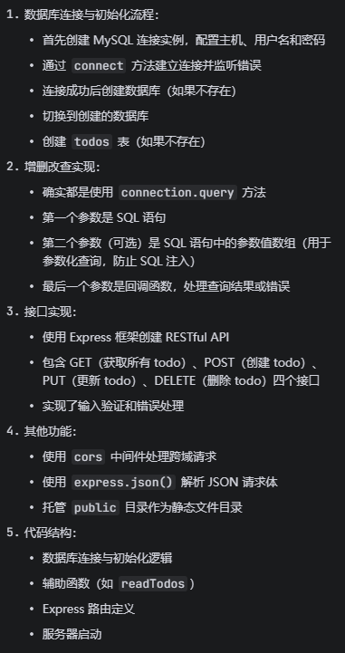

# nodejsTodoList

## index2.js TodoList项目总结

1. 创建数据库
SQLCREATE DATABASE IF NOT EXISTS lijiapeng
- 作用：如果 lijiapeng 数据库不存在，就创建它
- IF NOT EXISTS：防止数据库已存在时报错
2. 创建表结构
SQLCREATE TABLE IF NOT EXISTS todos (  id INT AUTO_INCREMENT PRIMARY KEY,  text VARCHAR(255) NOT NULL,  completed BOOLEAN DEFAULT FALSE,  created_at TIMESTAMP DEFAULT   CURRENT_TIMESTAMP)
- 作用：创建 todos 表，定义字段结构
- 字段说明：
- id：自增主键
- text：任务内容（最大255字符，非空）
- completed：完成状态（默认 false）
- created_at：创建时间（默认当前时间）
3. 检查数据量
SQLSELECT COUNT(*) as count FROM todos
- 作用：统计 todos 表中的记录数量
- 目的：判断是否需要插入初始数据
4. 插入初始数据
SQLINSERT INTO todos (text, completed) VALUES (?, ?)
- 作用：向 todos 表插入新记录
- ?：占位符，防止 SQL 注入
5. 查询数据
SQLSELECT * FROM todos ORDER BY id
- 作用：查询所有 todo 记录，按 ID 排序
6. 更新数据
SQLUPDATE todos SET text = ?, completed = ? WHERE id = ?
- 作用：更新指定 ID 的 todo 记录
7. 删除数据
SQLDELETE FROM todos WHERE id = ?
- 作用：删除指定 ID 的 todo 记录

